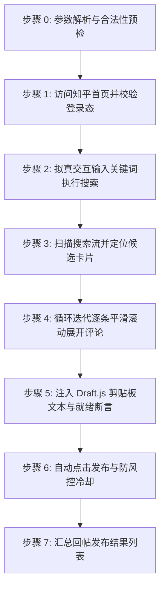

# 知乎相关主题自动回帖技能 (doudou-comment-zhihu)

本技能通过 `chrome-devtools-mcp` 控制浏览器，访问**知乎官网（https://www.zhihu.com/ ）**，根据用户输入的关键词自动搜索相关主题，并在搜索结果流中定位可回帖的内容卡片（专栏文章、问题回答），自动展开评论区，完成回复内容的拟真注入并自动点击发布提交。

技能严格遵循**真实人工行为模拟与全链路防风控规约**，包含微随机时延抖动、视口平滑滚动、React 受控属性同步、Draft.js 剪贴板词法树渲染、自动发布确认以及操作间防风控冷却间隔。

---

## 核心规约与防风控原则

1. **真实人机行为模拟 (Anti-Bot & Human Simulation)**：
   - **随机时延抖动**：所有操作之间增加微小随机等待（输入前 300~600ms、步骤间 800~1500ms、拟真悬停 300~500ms），彻底杜绝突发性机器调用特征。
   - **平滑视口滚动**：操作任意主题卡片前，先使用 `element.scrollIntoView({ behavior: 'smooth', block: 'center' })` 将目标平滑滚动至视口中心，触发浏览器可见性检测与渲染。
   - **真实事件完整性**：
     - 搜索框输入：使用 React 原生 Property Setter 同步受控组件状态，并按顺序派发 `focus`、`input`、`change` 事件。
     - 评论输入框：知乎评论采用 Facebook Draft.js 编辑器，使用标准 `DataTransfer` 构造 `paste` 剪贴板事件注入，触发词法分析器构建完整 ContentState。

2. **自动发布确认与就绪断言**：
   - 注入回复文本后，实时断言评论区底部「发布」按钮处于非禁用可提交状态（`disabled === false`）。
   - 确认激活后，模拟人类点击悬停 300~500ms，自动触发「发布」点击，并等待网络请求响应完成。

3. **频控与防封号冷却机制**：
   - 连续回帖极易触发知乎平台反垃圾与频控限制。每完成一条卡片的回帖发布后，强制执行 1500ms~3000ms 的随机冷却等待，严禁连续并发请求。

4. **异常容错与智能跳过**：
   - 若某主题卡片因作者设置关闭了评论，或开启了「评论精选」、或属于广告推广，自动记录原因并优雅跳过，顺延处理下一条候选卡片，确保达成设定的回帖目标条数。

5. **无回执轻量设计**：
   - 遵从极简自动化原则，**不创建或落盘任何回执文件**（不需要 `receipt.json`），所有执行过程、主题卡片链接与处理结果直接在控制台或上下文对话中输出。

---

## 参数规约

| 参数名 | 类型 | 必填 | 默认值 | 说明 |
| :--- | :--- | :---: | :---: | :--- |
| `keyword` | string | 是 | 无 | 检索的主题关键词（例如：`自媒体`、`AI编程`） |
| `content` | string | 是 | 无 | 回复的内容文本（支持 Markdown 或文章链接，知乎会自动解析链接卡片） |
| `count` | number | 否 | `5` | 回帖处理目标条数（默认 5 条） |

---

## 自动化执行全流程



---

### 步骤 0：参数解析与预检

确认用户提供的参数：
- 关键词（如 `"自媒体"`）
- 回复内容（如 `"自媒体创作避坑 https://zhuanlan.zhihu.com/p/2078843612532568622"`）
- 回帖条数（默认 5 条）

---

### 步骤 1：访问知乎首页并验证登录态

1. 优先复用已有知乎标签页或通过 `new_page` 打开 `https://www.zhihu.com/`。
2. 调用 `evaluate_script` 检查页面状态：
   - 检查是否存在登录弹窗（`.sign-flow-modal, .Modal-wrapper`）；
   - 检查头像元素（`.AppHeader-userAvatar, .Avatar`）确认已登录；
   - 若未登录，停止后续动作并提示用户在浏览器中完成扫码登录。

---

### 步骤 2：拟真交互输入关键词执行搜索

1. 定位首页顶部搜索框：
   - 选择器：`input#Popover1-toggle, .SearchBar-input input, input[type="text"]`
2. 拟真聚焦输入框并随机停顿 300~600ms。
3. 同步 React 受控组件值：
   ```javascript
   const setter = Object.getOwnPropertyDescriptor(window.HTMLInputElement.prototype, 'value').set;
   setter.call(searchInput, keyword);
   searchInput.dispatchEvent(new Event('input', { bubbles: true }));
   searchInput.dispatchEvent(new Event('change', { bubbles: true }));
   ```
4. 定位并点击搜索按钮 `.SearchBar-searchButton`（或派发 Enter 键）。
5. 等待页面跳转至搜索结果页（`https://www.zhihu.com/search?type=content&q=...`）。

---

### 步骤 3：扫描搜索流并定位候选卡片

在搜索结果页面中：
1. 扫描所有的内容卡片（`.SearchResult-Card, .ContentItem`）。
2. 提取满足下列条件的候选卡片：
   - 包含文章/回答标题（`h2 a, .ContentItem-title a`）；
   - 包含评论按钮（`button` 文本含有 `评论` 或 `添加评论`，排除 `收起评论`）；
3. 若首屏卡片数量少于目标 `count` 条数，平滑滚动页面触底加载更多（`window.scrollBy({ top: 1200, behavior: 'smooth' })`），再次扫描补充。

---

### 步骤 4：循环迭代逐条回帖并自动发布

对于筛选出的每一条候选卡片（1 到 `count`）：

1. **平滑居中滚动**：
   ```javascript
   card.scrollIntoView({ behavior: 'smooth', block: 'center' });
   ```
   随机停顿 800~1200ms。

2. **点击展开评论**：
   点击卡片上的评论按钮，随机停顿 1200~1800ms 等待评论容器（`.Comments-container`）渲染展开。

3. **定位评论编辑器**：
   找到 Draft.js 编辑器容器：`.public-DraftEditor-content`。
   - 若未找到输入框（可能被作者关闭评论或设置仅好友评论），登记 `skipped` 并跳过处理下一张卡片。

4. **注入回复内容**：
   聚焦编辑器并派发 `paste` 剪贴板事件：
   ```javascript
   editor.focus();
   const dt = new DataTransfer();
   dt.setData('text/plain', replyContent);
   const pasteEvt = new ClipboardEvent('paste', {
     clipboardData: dt,
     bubbles: true,
     cancelable: true
   });
   editor.dispatchEvent(pasteEvt);
   ```
   随机等待 600~1000ms 触发 Draft.js 词法树更新与链接卡片解析。

5. **就绪状态断言**：
   定位评论区底部的「发布」按钮（`.Comments-container button` 包含 `发布` 字样）：
   - 断言判据：`Boolean(publishBtn && !publishBtn.disabled)`
   - 当判据为 `true` 时，断言通过，确认内容已被知乎编辑器识别并激活提交能力。

6. **自动点击发布**：
   - 悬停聚焦「发布」按钮 300~500ms；
   - 派发真实点击事件：`publishBtn.click()`；
   - 随机停顿 1500~2500ms 等待知乎接口网络响应完成；
   - 登记状态为 `published`。

7. **防风控冷却间隔**：
   在处理下一张卡片前，随机休眠 1500ms~3000ms。

---

### 步骤 5：汇总回帖结果列表

在自动化执行结束时，以结构化列表呈现回帖执行结果，包括：
- 卡片序号
- 主题标题
- 目标链接
- 处理状态（`published` / `skipped`）
- 发布完成确认

---

## 异常与风控处理

| 异常场景 | 现象特征 | 应对策略 |
| :--- | :--- | :--- |
| **未登录 / 登录态失效** | 出现 `.sign-flow-modal` 或无用户头像 | 中断执行，提示用户扫码登录，登录后无缝重试。 |
| **评论功能受限 / 关闭** | 卡片无评论按钮，或展开后无输入框 | 记录原因（如「作者关闭评论」），自动跳过并顺延处理后续主题。 |
| **反爬频控或验证码** | 页面弹出滑块或行为验证码 | 立即停止自动化点击，保留现场，提示用户手动完成验证。 |
| **候选主题数量不足** | 首屏不足 `count` 条 | 自动分步平滑滚动页面触底拉取下一页，直到集齐或无可加载内容。 |

---

## 脚本工具与使用方法

技能目录下提供自包含的模块化脚本：`scripts/zhihu_commenter.mjs`。

### 1. 命令行直接执行

```bash
node scripts/zhihu_commenter.mjs --keyword "自媒体" --content "自媒体创作避坑 https://zhuanlan.zhihu.com/p/2078843612532568622" --count 5
```

### 2. 在 Agent 中配合 `chrome-devtools-mcp` 调用

```javascript
import { buildSearchScript, buildCommentScript } from './scripts/zhihu_commenter.mjs';

// 步骤 1：在知乎首页触发搜索
await evaluate_script({
  pageId: targetPageId,
  function: buildSearchScript('自媒体')
});

// 步骤 2：在搜索结果页执行防风控自动回帖并发布
const result = await evaluate_script({
  pageId: targetPageId,
  function: buildCommentScript({
    content: '自媒体创作避坑 https://zhuanlan.zhihu.com/p/2078843612532568622',
    count: 5
  })
});
```
